# 快速小作業Demo

## 條件如下
```
    完成度示意: 

    完成:😎

    不確定或是做一半:🤔

    不會做:😥

    1. 用Vue Cli或Nuxt 完成以下功能 😎

    2. 以scss撰寫內容樣式 😎

    3. 應用component功能 😎

    4. 應用computed功能 😎

    5. 製作 輸入類型 text, radio, select 、
    同一component切換prop來改變對應的輸入類型，並可套用v-model 😎

    6. 可切換頁面 😎

    7. 設定頁面title, description  🤔

    8. 設定Global參數、讓頁面的顏色、主題會隨著更換 😎

    9. 串接一組列表資料api(https://mocki.io/fake-json-api) 😎

    10. 程式架構做到最大的沿用性、維護性，並於Readme說明你的想法 😎

    11. 使用Firebase Hosting，提供連結 😎

    12. 提供Github程式碼😎

    P.S 第七題有做出來，但是不確定這樣做是否正確，以下內容有說明與描述。
```

# 我的作品---[FireBase連結](https://project-done-demo.web.app/)

# 專案說明
#### 本專案採取Vue Cli作為建置環境，並且安裝了Sass Loader 以便可以使用SCSS來撰寫CSS樣式

<br/>

#### 本人使用在專案中使用了Vue Router, Vuex以及Axios

<br/>

#### 會使用Axios是因為上一次的獨立專案也是使用Axios，因喜愛其方便簡單的使用方式，所以決定使用它

<br/>

# Components架構

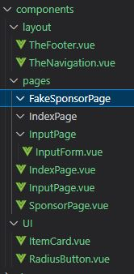

#### 雖然本次並沒有將Component拆解至最小化(因為會造成傳值的複雜度)

<br/>

#### 但是假設日後有要多新增組件，這樣的架構可以比較方便後續新增與開發

<br/>

# Computed與v-model功能說明

#### 本次專案製作的Computed與v-model功能都在輸出頁面，息息相關，因此將兩者放在一起進行說明

<br/>

#### 在InputPage.vue中，我將表單單獨做成一個Component並且在裡面並且使用v-model綁定了使用者輸入的各種資料，並且根據條件利用Button來更改參數，並使用prop改變輸入類型，一次只顯示單一輸入類型。

<br/>

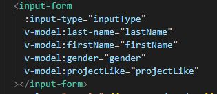

<br/>

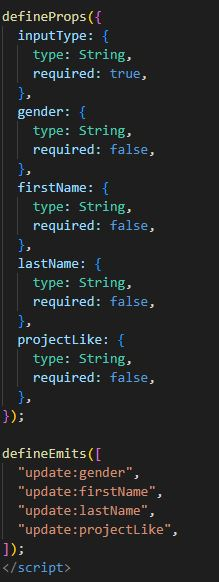

<br/>


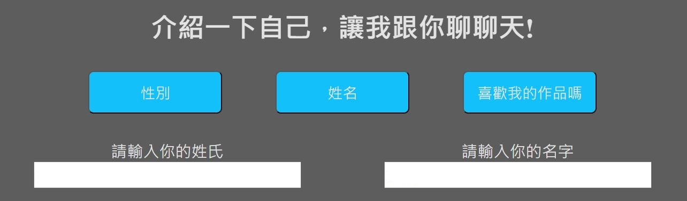

<br/>

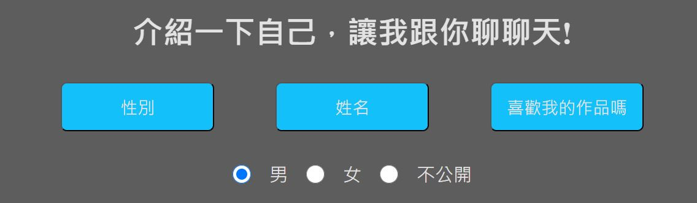

<br/>

#### 另外，在使用者輸入不同的資料之後，我也Computed讓畫面上的內容呈現不同的反饋。

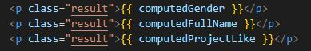

<br/>

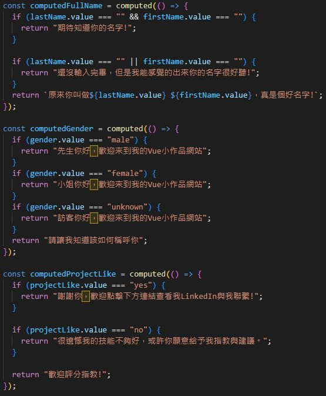

<br/>

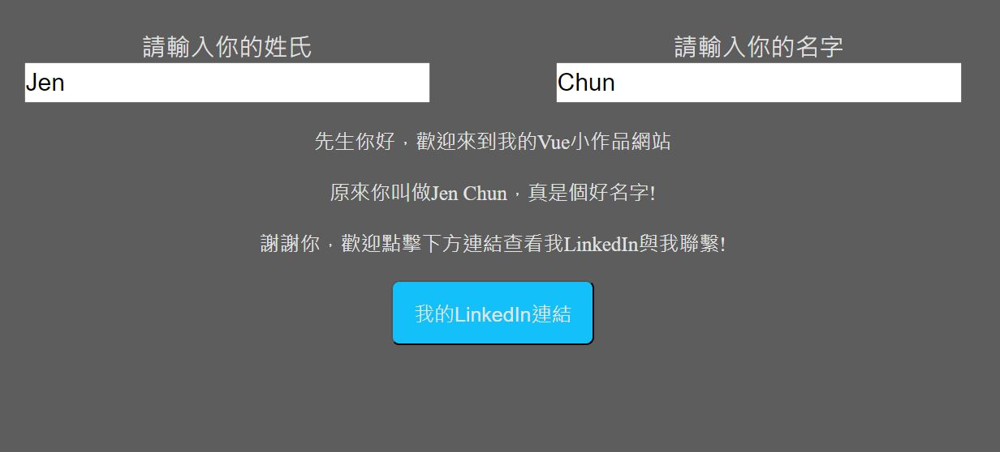

<br/>


<br/>

# Router與頁面Title
#### 頁面切換時我透過**router.beforeEach**，在每次換頁之後根據每個路徑的**meta**的**title**動態切換每頁的標題(如下圖)

<br/>

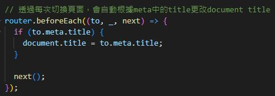

<br/>

#### **_唯一不確定該如何動態更改Description，非常遺憾本人目前的能力尚不足以解決這個問題(如下圖)_**

<br/>

#### **_只能先以這種方式來處理靜態的description與其content(不知是否符合題目需求或是有更好的方法使用？)_**

<br/>

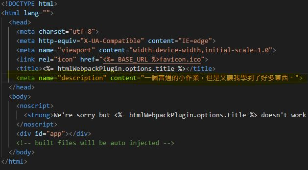

<br/>

# Global 參數改變主題
#### 透過Vuex來建立全域變數，這樣子可以免於Inject跟Provide的麻煩，避免程式架構變得混亂、資料的傳遞越來越繁雜，因此我認為這是最好的辦法(即使這樣會多了不少行程式碼，但是日後較好擴充)。

<br/>

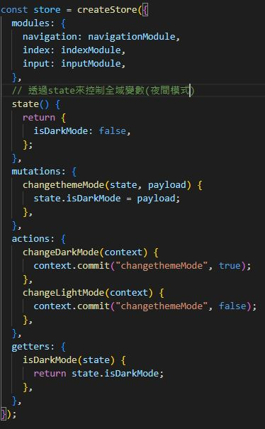

#### 我另有把其他頁面的store架構也都先建置好，以免日後有想要新增或是改寫，有備無患。

<br/>

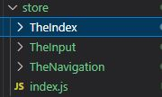

<br/>

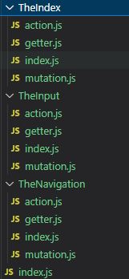

<br/>

# 利用Axios抓取Fake Json API
#### 本次利用的是Axios API，抓取的資料是[這串API資料](https://mocki.io/v1/d4867d8b-b5d5-4a48-a4ab-79131b5809b8)

<br/>

#### 很簡單的使用了一個Axios函數，抓取了資料，並進行了簡單try catch語法進行例外處理，當抓到資料之後，會自動把值加入data變數當中，將其渲染到畫面上。

<br/>

#### 假設還在等待資料加載，畫面上會顯示等待中的訊息，以避免使用者以為出現故障的情形。(使用了v-if，呈現出不同的資訊)

<br/>

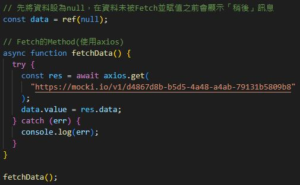


## Project setup
```
npm install
```

### Compiles and hot-reloads for development
```
npm run serve
```

### Compiles and minifies for production
```
npm run build
```

### Lints and fixes files
```
npm run lint
```

### Customize configuration
See [Configuration Reference](https://cli.vuejs.org/config/).
